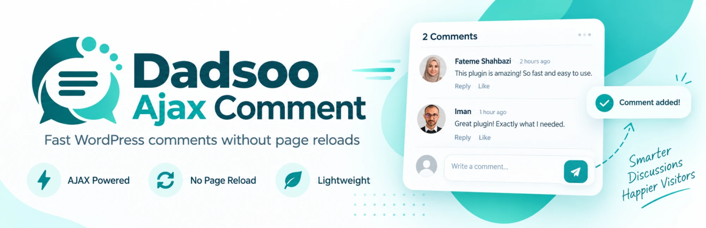

# Dadsoo Ajax Comment

English | [فارسی](README.md)

A lightweight WordPress plugin for a custom AJAX-driven comment form and list.

## Features

✅ Post comments without reloading the page
✅ Progressive loading of approved comments
✅ Threaded replies up to three levels deep
✅ Instant publishing for logged-in users with the `moderate_comments` capability
✅ Like/dislike voting that can be changed or undone, recorded server-side (clearing cookies can't be used to vote again)
✅ Uses the WordPress avatar and displays the comment date
✅ CSS/JS load only on pages that actually use the shortcode or widget
✅ Loading indicator, an "no comments" empty state, and scroll-and-flash on the first newly loaded comment
✅ Configurable load-more button text and loading/empty messages
✅ Records IP address and user agent for moderation and spam review
✅ Nonce-verified AJAX requests, a honeypot field on forms, and comments routed through Akismet and WordPress's moderation rules
✅ Two independent Elementor widgets for the comment form and the comments list
✅ Comments-per-initial-load setting from inside the list widget
✅ Elementor style controls for the avatar, author name, comment text, icons, and like/dislike states

## Requirements

- WordPress 5.8 or newer
- PHP 7.4 or newer
- jQuery (bundled with WordPress core)
- Elementor (only for the widgets — the shortcodes don't need it)

## Installation

1. Place the plugin folder at `wp-content/plugins/dadsoo-ajax-comment`.
2. Activate the plugin from the "Plugins" screen in the WordPress dashboard.
3. Use the following shortcodes on any page or template:

   ```text
   [dadsoo-ajax-comment-form]
   [dadsoo-ajax-comments]
   [dadsoo-ajax-comments items="10"]
   [dadsoo-ajax-comments items="10" avatar_size="72"]
   [dadsoo-ajax-comments load_more_text="More comments" loading_text="One moment…" empty_text="Be the first to comment"]
   ```

Guest comments and replies are recorded as "pending" and can be moderated from the WordPress Comments screen. Users with the `moderate_comments` capability (Administrators and Editors) have their comments published immediately and shown in the list without a page reload.

## Elementor Widgets

Once Elementor is installed, two widgets are available under the General category:

- `Dadsoo Ajax Comment Form` for the comment submission form
- `Dadsoo Ajax Comments` for the comments list

List widget controls:

| Section | Control |
| --- | --- |
| List Settings | Comments per initial load (1–100), load-more button text, loading state text, empty state text |
| Vote Icons | Like/dislike icons, each for the inactive (Outline) and active (Fill) state |
| Author | Avatar size and border radius, author name color and typography |
| Comment Text | Comment text color and typography |
| Load More | Typography, text/background color (normal and hover), border, padding, border radius, loading/empty message color, flash color, and scroll offset from top |
| Like / Dislike Button | Padding, border radius, and — separately for active/inactive states — icon color, background color, and border |

Icons render through `Elementor\Icons_Manager::render_icon()`, so both Elementor's icon library and uploaded SVGs are supported. Because the comments list arrives via AJAX, Font Awesome is preloaded before that request with `Icons_Manager::enqueue_shim()`. If Elementor shows stale output, run `Regenerate Files & Data` from `Elementor → Tools`.

## Load More

The list arrives via AJAX, page by page. A spinner shows while a batch loads; the server reports in every response whether another page exists, so the button hides on the last page even when the total count is an exact multiple of the page size.

After each "load more", the page scrolls to the first newly loaded comment and flashes around it for about two seconds. If your theme has a sticky header that covers the top of the comment, set the "Scroll offset from top" control in the widget, or change `--dadsoo-scroll-offset` in your own CSS:

```css
.dadsoo-comments-container { --dadsoo-scroll-offset: 140px; --dadsoo-flash-color: #e91e63; }
```

## Reply Depth

Replies are shown nested up to three levels. At the third level the "Reply" button is hidden, and the server also rejects a deeper reply, so no approved comment is ever created that the list couldn't display.

## Testing

The integration test runs through WP-CLI and cleans up its own test post afterward:

```text
wp eval-file tests/integration-smoke.php --path=<wordpress-path>
```

Output is JSON; the `failed_checks` key must be an empty array.

## Upgrading from Elin versions (before 3.0)

Version 3.0 renamed every `elinweb`/`elin` identifier to `dadsoo`. So existing sites keep working:

| Item | Status |
| --- | --- |
| `elinweb_agax_likes` and `elinweb_agax_dislikes` meta | Migrated automatically to the `dadsoo_` prefix the first time the plugin loads |
| Votes that only lived in the `elinweb_agax_vote_*` cookie | Read once and converted into a server-side record |
| `[elin-agax-comment-form]` and `[elin-agax-comments]` shortcodes | Still work (deprecated) |
| Elementor widgets named `elinweb-agax-*` | Still render, but no longer shown in the widget panel |
| `elinweb_agax_comment()` function | Mapped to `dadsoo_agax_comment()` |

Because the plugin's main file was renamed from `elin-agax-comment.php` to `dadsoo-agax-comment.php`, WordPress deactivates the plugin — reactivate it once from the "Plugins" screen after updating.

If you've customized the plugin's JavaScript, the global object `elinwebAgaxComment` is now named `dadsooAjaxComment` (it was mistakenly `dadsooAgaxComment` in 3.x — see the section below), and the icon CSS classes changed from `elinweb-*` to `dadsoo-*`.

## Fixing the agax → ajax typo (version 4.0)

Versions 3.x mistakenly used "agax" instead of "ajax" in every identifier (a leftover from an even older plugin name). Version 4.0 corrects this everywhere: the plugin folder and main file, class name, AJAX actions, nonce, meta keys, cookies, shortcodes, Elementor widget names, text domain, and the JS global. So existing sites keep working:

| Item | Status |
| --- | --- |
| `dadsoo_agax_likes`/`dislikes` meta and the `dadsoo_agax_vote_*` vote prefix | Migrated automatically to `dadsoo_ajax_*` the first time the plugin loads |
| Votes that only lived in the `dadsoo_agax_vote_*` cookie | Read once, same as previous versions |
| `[dadsoo-agax-comment-form]` and `[dadsoo-agax-comments]` shortcodes | Still work (deprecated) |
| Elementor widgets named `dadsoo-agax-*` | Still render, but no longer shown in the widget panel |
| `dadsoo_agax_comment()` function | Mapped to `dadsoo_ajax_comment()` |

**The plugin folder name also changed**, from `dadsoo-agax-comment` to `dadsoo-ajax-comment` — this goes beyond an internal file rename. To update an existing install:

1. Deactivate the old plugin from the dashboard (no need to delete it — meta and cookies stay in the database).
2. Place the new folder (`dadsoo-ajax-comment`) in `wp-content/plugins/`.
3. Activate the new plugin. The data migration above runs automatically at that moment.
4. You can then delete the old folder (`dadsoo-agax-comment`).

## Development

The plugin's main file is `dadsoo-ajax-comment.php`. Browser-side styles and behavior live in `assets/css/style.css` and `assets/js/script.js` respectively. The project is developed and maintained by [Elinweb](https://elinweb.ir).

## Language and Translation

As of version 3.2.0, the plugin's source strings (inside `__()`/`_e()`) are in English. As of version 4.0.1, the plugin no longer ships any `.po`/`.mo` file or calls `load_plugin_textdomain()` — per WordPress.org plugin review feedback, a hosted plugin should leave translations entirely to [translate.wordpress.org](https://translate.wordpress.org/), which WordPress loads automatically as needed.

The built Persian translation is kept at `translations/dadsoo-ajax-comment-fa_IR.po` and `.mo` (not part of the plugin package — reference only, and the source for a future GlotPress submission). `languages/dadsoo-ajax-comment.pot` stays in the plugin itself as the source template.

**To keep a site such as dadsoo.com showing Persian before the official translation is approved**, drop the `.mo` file directly into WordPress's central language directory (not inside the plugin's own folder) — the same location WordPress core and the translation system both use:

```text
wp-content/languages/plugins/dadsoo-ajax-comment-fa_IR.mo
```

To update the Persian translation after changing strings:

```text
wp i18n make-pot . languages/dadsoo-ajax-comment.pot --domain=dadsoo-ajax-comment --exclude=tests,languages,translations
wp i18n make-mo translations/dadsoo-ajax-comment-fa_IR.po translations/
```

## Publishing to the WordPress Plugin Directory

A `readme.txt` (the WordPress.org standard format) is ready at the plugin root. Before submitting:

1. The `Contributors` value in `readme.txt` is set to the real wordpress.org account username (`imansh`).
2. Run the official [Plugin Check](https://wordpress.org/plugins/plugin-check/) plugin against the final build. As of this writing, only two low-severity warnings remain (the `.gitignore` file, which isn't part of the shipped zip, and the deliberate `load_plugin_textdomain()` call kept for installs outside the WordPress.org directory).
3. Submit the final zip — without `tests/`, `.git`, `.gitignore`, `README.en.md` (Plugin Check only accepts `README.md`/`readme.txt`/`LICENSE(.md)`/`CHANGELOG.md`/`CONTRIBUTING.md`/`SECURITY.md` at the plugin root), or other hidden files — at <https://wordpress.org/plugins/developers/add/>. `README.en.md` stays in the GitHub repo only.

### Plugin Page Banner and Icon

The plugin page's display assets (not part of the plugin's code) live in `.wordpress-org/`:

| File | Size | Use |
| --- | --- | --- |
| `banner-1544x500.png` | 1544×500 | Plugin page header banner (retina) |
| `banner-772x250.png` | 772×250 | Standard banner |
| `icon.svg` | Scalable | Plugin icon in listings and the detail page (SVG alone is sufficient — no separate PNG needed) |
| `logo.svg` | Scalable | Full logo (icon + name), for external use such as this README only |

This folder is not part of the plugin's code and isn't included in the zip submitted to WordPress.org. The directory reads these files from the `assets/` folder in SVN — **that folder is only created after the plugin's initial approval.** After approval:

```text
svn co https://plugins.svn.wordpress.org/dadsoo-ajax-comment
cp .wordpress-org/banner-*.png .wordpress-org/icon.svg dadsoo-ajax-comment/assets/
svn add dadsoo-ajax-comment/assets/*
svn commit -m "Add plugin page banner and icon" dadsoo-ajax-comment
```

The license is GPL v2 or later (the `License`/`License URI` fields in the plugin header and in `readme.txt`).

Author: **Iman Shadmehri** · WordPress.org account: [imansh](https://profiles.wordpress.org/imansh/) · [Elinweb](https://elinweb.ir)
